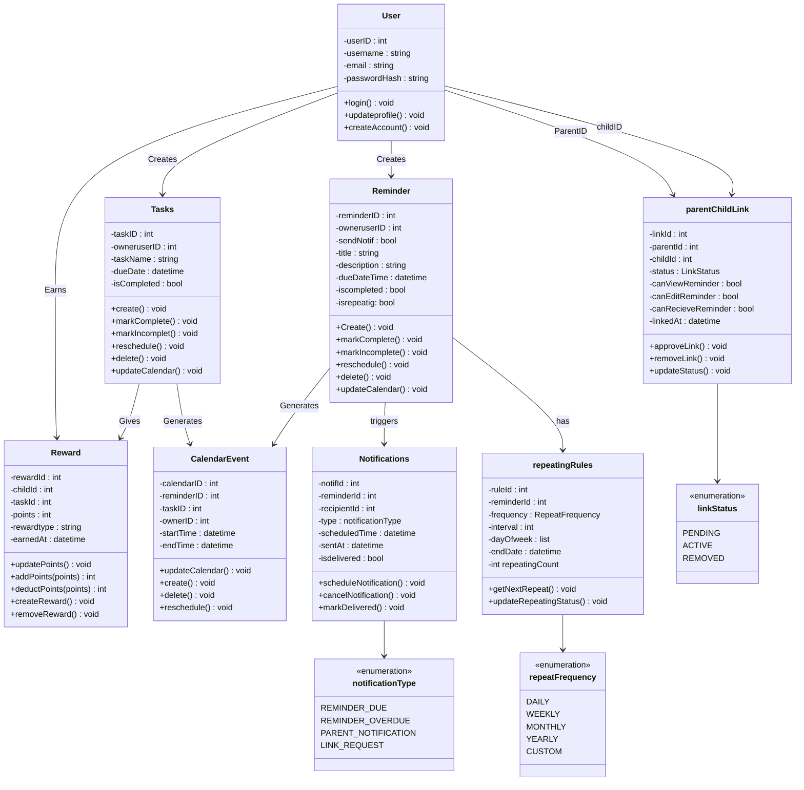

```mermaid
%%This is a file created using Mermaid code to generate visual diagrams and charts%%


classDiagram

    %% ---Class Relationships--- %%
    User --> Tasks : Creates
    User --> Reminder : Creates
    User --> parentChildLink : ParentID
    User --> parentChildLink : childID
    User --> Reward : Earns
    Tasks --> CalendarEvent : Generates
    Tasks --> Reward: Gives
    Reminder --> CalendarEvent : Generates
    Reminder --> Notifications : triggers
    Reminder --> repeatingRules : has
    repeatingRules --> repeatFrequency
    Notifications --> notificationType
    parentChildLink --> linkStatus

    %% ---Class Entities--- %%

    class User {
        -userID : int 
        -username : string 
        -email : string 
        -passwordHash : string 
        +login() void
        +updateprofile() void 
        +createAccount() void
    }

    class Tasks{
        -taskID : int 
        -owneruserID : int 
        -taskName : string 
        -dueDate : datetime
        -isCompleted : bool
        +create() void
        +markComplete() void
        +markIncomplet() void
        +reschedule() void
        +delete() void
        +updateCalendar() void
    }

    class CalendarEvent{
        -calendarID : int
        -reminderID : int
        -taskID : int
        -ownerID : int
        -startTime : datetime
        -endTime : datetime
        +updateCalendar() void
        +create() void
        +delete() void
        +reschedule() void
    }

    class Reminder{
        -reminderID : int
        -owneruserID : int
        -sendNotif : bool
        -title : string
        -description : string
        -dueDateTime : datetime
        -iscompleted : bool
        -isrepeatig: bool
        +Create() void
        +markComplete() void
        +markIncomplete() void
        +reschedule() void
        +delete() void
        +updateCalendar() void
    }

    class repeatingRules {
        -ruleId : int
        -reminderId : int
        -frequency : RepeatFrequency
        -interval : int
        -dayOfweek : list <day>
        -endDate : datetime
        -int repeatingCount
        +getNextRepeat() void
        +updateRepeatingStatus() void
    }

    class Notifications {
        -notifId : int
        -reminderId : int
        -recipientId : int
        -type : notificationType
        -scheduledTime : datetime
        -sentAt : datetime
        -isdelivered : bool
        +scheduleNotification() void
        +cancelNotification() void
        +markDelivered() void
    }

    class parentChildLink {
        -linkId : int
        -parentId : int
        -childId : int
        -status : LinkStatus
        -canViewReminder : bool
        -canEditReminder : bool
        -canRecieveReminder : bool
        -linkedAt : datetime
        +approveLink() void
        +removeLink() void
        +updateStatus() void
    }

    class Reward {
        -rewardId : int
        -childId : int
        -taskId : int
        -points : int
        -rewardtype : string
        -earnedAt : datetime
        +updatePoints() void
        +addPoints(points) int
        +deductPoints(points) int
        +createReward() void
        +removeReward() void
    }

    class linkStatus {
        <<enumeration>>
        PENDING
        ACTIVE
        REMOVED
    }

    class notificationType {
        <<enumeration>>
        REMINDER_DUE
        REMINDER_OVERDUE
        PARENT_NOTIFICATION
        LINK_REQUEST
    }

    class repeatFrequency {
        <<enumeration>>
        DAILY
        WEEKLY
        MONTHLY
        YEARLY
        CUSTOM
    }

```